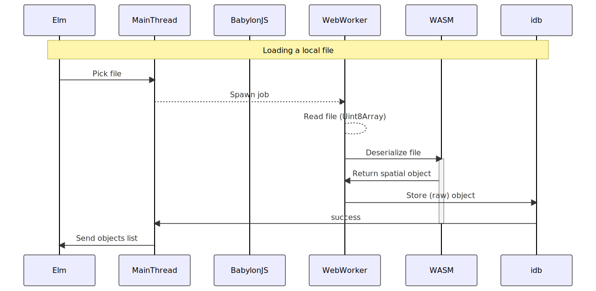

# Integrating WASM <br> Building and deploying WASM within a web app

# Presenter Notes

to build preso `landslide ./pres.md -i -x extra -t ~/landslide-themes/simple/`

see also: [[Content]]

---

# Usage Context

- Used with a (experimental) 3D visualiser for mining data
- 👉 https://kurtlawrence.github.io/dirtvz/
- https://www.kurtlawrence.info/blog/detailed-web-based-3d-rendering-of-mining-spatial-data
- The WASM module is used for processing of the data:
	- Decoding binary data into triangle mesh structures
	- Sampling meshes into various LODs and tiles
	- On demand building of vertex data when loading tiles

---

# Overview

- **Introduction**
	- Usage context
	- Benefits of WASM
 - **Building and deploying**
	- Project structure
	- Webpack config
	- Deployment building
	- Rust dependencies
	- WASM JS -> TS
- **Integration examples**
	- Decoding binary data
	- Generating representations

---

# Benefits of WASM (or, why WASM?)

- Anecdotally faster?
- Write code in Rust!
- **Use existing libraries**
	- https://github.com/kurtlawrence/geom
- Leverage more complex data structures
- Excels at things like string parsing, binary data encoding/decoding
- Testing (like `quickcheck`)

---

# Building and Deploying

---

# Project Structure

- Incorporating WASM into webapp packaged with `webpack` and Elm frontend
- 👉 https://github.com/kurtlawrence/dirtvz
- Folderised on _language_

```sh
# Build Rust to WASM
#   use --debug for debugging, BUT IS VERY SLOW!
#   use --features=err-capture to get Rust stack trace printed to console
wasm-pack build --out-dir wasmpkg --out-name wasm --target bundler
# Builds Elm
elm make elm/ViewerUI.elm --output=js/viewer-ui.js
# Builds Typescript and bundles
npm run build
# Runs local dev server
npm start
```

---

# Project Structure

```plaintext
dirtvz/
├── elm/                          <- Elm source
├── js/
│   └── viewer-ui.js              <- Elm compiles to this
├── rust/                         <- Rust source
│   └── lib.rs                    
├── ts/                           <- Typescript source
│   ├── viewer/
│   ├── index.ts                  <- Entry point (lib)
│   ├── viewer-ui.ts              <- Entry point (UI)
│   ├── wasm.ts                   <- Wrapper around `wasmpkg/wasm.js`
│   ├── worker-spawn.ts
│   └── worker.ts                 <- Entry point (worker)
├── wasmpkg/                      <- Generated from `wasm-pack`
│   ├── package.json
│   ├── README.md
│   ├── wasm_bg.js
│   ├── wasm_bg.wasm
│   ├── wasm_bg.wasm.d.ts
│   ├── wasm.d.ts
│   └── wasm.js
├── Cargo.toml
├── elm.json
└── webpack.config.js
```

---

# Webpack Config

```js
module.exports = {
  // multiple packages
  entry: {
    dirtvz: "./ts/index.ts",
    "dirtvz-ui": "./ts/viewer-ui.ts",
	"dirtvz-worker": './ts/worker.ts',
  },
  // wasm support
  experiments: {
    asyncWebAssembly: true,
  },
  output: {
    path: dist, // <-- Bundle ends up here
    filename: "[name].js",
    library: "dirtvz",
    libraryTarget: "umd",
  },
//     new WasmPackPlugin({
//       crateDirectory: __dirname,
//       outName: "wasm",
//    }),
  ],
};
```

---

# Building for Deployment

👉 https://github.com/kurtlawrence/dirtvz/blob/main/Notes/DEPLOY.md

- Similar to dev (optimise for Elm code)
- After `npm run build` we get the contents of `dist/`

```plaintext
dist
├── 7daa9fc839da80a96cc0.module.wasm <- This changes each build
├── dirtvz.js                        <- entry point (lib)
├── dirtvz-ui.js                     <- entry point (UI)
├── dirtvz-worker.js                 <- entry point (worker)
├── favicon.ico
├── icon512.png
├── index.css
└── index.html
```

- Run a minification
	- `uglifyjs dist/*.js --mangle --compress --in-situ`
- manually add artifacts to release page
- manually publish release of demo page

---

# Getting Dependencies to Build

- transitive dependencies can break builds if unable to target wasm
- `geom` depends of `dxf` which itself has a dependency on `uuid`
- `uuid` has feature (`js`) to enable targeting `wasm32-unknown-unknown`

👉 https://github.com/ixmilia/dxf-rs/pull/43

---

# Exporter File

- Had issues with importing wasm from `wasmpkg/`
- Introduced a simple typescript that exports directly
- Makes it a single point of change

```typescript
// in ts/wasm.ts
export * from './../wasmpkg/wasm';
export { memory } from './../wasmpkg/wasm_bg.wasm';
```

---

# Integration Examples

---

# Decoding Binary Data


	
---

# Decoding Binary Data

```typescript
// worker.ts
async function read_load_and_store_from_spatial_file(
	db_name: string,
	file: File // <-- WebWorker can pass through File
): Promise<FlatTreeItem[]> {
	let obj = await local_loader.parse_file(file); // <--

	let db = await Store.connect(db_name);
	await db.store_object(obj.key, obj.obj); // <--

	return [{ path: obj.name, key: obj.key, status: null }];
}
```

---

# Decoding Binary Data

```typescript
// local-loader.ts
export async function parse_file(file: File): Promise<SpatialObject> {
    // snip
	let data = await file.arrayBuffer().then(x => new Uint8Array(x));
	if (data.byteLength > 2.2e9)
		throw new Error('file is too large: a 2.2 GB limit is imposed');

	switch (ext) {
		case '':
			throw new Error('file has no extension');

		case '00t':
			if (data.byteLength > 100e6)
			 	throw new Error('file is too large: 00t must be smaller than 100 MB');

			try {
                // Rust code!
				let mesh = TriangleMeshSurface.from_vulcan_00t(data);
				return SpatialObject.triangle_mesh_surface(name2, mesh);
			} catch (error) {
				throw new Error('unable decode to Vulcan file: ' + error);
			}

		default:
			throw new Error('extension `' + ext + '` is currently unsupported');
	}
}
```

---

# Decoding Binary Data

```rust
impl TriangleMeshSurface {
    /// Deserialise a Vulcan 00t triangulation.
    pub fn from_vulcan_00t(data: &[u8]) -> Result<TriangleMeshSurface, String> {
        init_panic_hook(); // <--

        let tri = geom::io::trimesh::from_vulcan_00t(data).map_err(|e| e.to_string())?;
        let translate = tri.aabb().origin;
        let (points, indices) = tri.decompose();

        let points = points
            .into_iter()
            .flat_map(|p| p.sub(translate).map(|x| x as f32))
            .collect();
        let indices = indices
            .into_iter()
            .flat_map(|(a, b, c)| [a, b, c])
            .collect();
        let translate = translate.into();

        Ok(Self {
            translate,
            points,
            indices,
        })
    }
}
```

---

# Storing `TriangleMeshSurface`

```typescript
async store_object(key: string, obj: TriangleMeshSurface): Promise<SpatialObject> {
	// remove any previous object with that key
	await this.delete_object(key);

	// write the bytes out
	await this.transact('raw-objs', 'readwrite', store => {
		const bytes = obj.to_bytes(); // <--
		return store.put_bytes(key, bytes);
	});

	const o = { key, status: Status.Preprocessing, roots: [], tiles: [] };
	await this.update_object_list(o);

	return o;
}
```

---

# Storing `TriangleMeshSurface`

```rust

wasm_bindgen_store_impl!(TriangleMeshSurface);
impl Store for TriangleMeshSurface {
    fn to_bytes(&self) -> Vec<u8> {
        // snip..
    }

    fn from_bytes(bytes: &[u8]) -> Result<Self, String> {
        // snip..
    }
}

macro_rules! wasm_bindgen_store_impl {
    ($t:ty) => {
        #[wasm_bindgen]
        impl $t {
            pub fn to_bytes(&self) -> Vec<u8> {
                Store::to_bytes(self)
            }
            pub fn from_bytes(bytes: &[u8]) -> Result<$t, String> {
                Store::from_bytes(bytes)
            }
        }
    };
}
```


---

# Generating Representations

```typescript
async function preprocess_spatial_object(
	db_name: string,
    objkey: string,
    progress: prgrs.Channel
): Promise<boolean> {
	const db = await Store.connect(db_name);
	const mesh = await db.get_object(objkey); // <-- (from_bytes)

	const hash = mesh.generate_tiles_hash(extents); // <--
	const tiles = hash.tiles(); // <--

	for (const tile_idx of tiles) {
		const zs = hash.sample(tile_idx); // <--
		if (zs) {
			await db.store_tile(objkey, tile_idx, zs);
		}
	}
}
```

---

# Generating Representations

```rust
impl TriangleMesh {
    pub fn generate_tiles_hash(&self, extents: &Extents3) -> TileHash {
        init_panic_hook();
        // snip..
        TileHash {
            tris,
            tiles,
            extents: *extents,
        }
    }
}
```

---

# Generating Representations

```rust
#[wasm_bindgen]
pub struct TileHash {
    tris: Vec<Tri>,
    tiles: HashMap<u32, Vec<usize>>,
    extents: Extents3,
}

#[wasm_bindgen]
impl TileHash {
    pub fn tiles(&self) -> Vec<u32> {
        self.tiles.keys().copied().collect()
    }

    pub fn sample(&self, tile_idx: u32) -> Option<Vec<f32>> {
        init_panic_hook();
        // snip..
        let grid = Grid::sample_with_bounds(..);
        // snip..
    }
}
```

---

# Closing Thoughts

- Structs turn into (function) points in JS land
	- Little ability to pass by value, even for simple structs
	- eg `Point3`
- Passing by value will null out the value in JS land
	- Even when value is `Copy`
- Panics in Rust cause headaches
- `wasm-pack --debug` is SLOW
- 32bit memory address support
- Coding for WASM breaks Rust 'idioms'
	- Results in an interop crate

---

# Thanks!

_Blog post:_

.qr: 450|https://www.kurtlawrence.info/blog/detailed-web-based-3d-rendering-of-mining-spatial-data

---

# Tip: Printing Stack Trace

- Invoke `init_panic_hook` at entry points

```rust
#[cfg(feature = "err-capture")]
fn init_panic_hook() {
	console_error_panic_hook::set_once();
}
#[cfg(not(feature = "err-capture"))]
fn init_panic_hook() {}
```